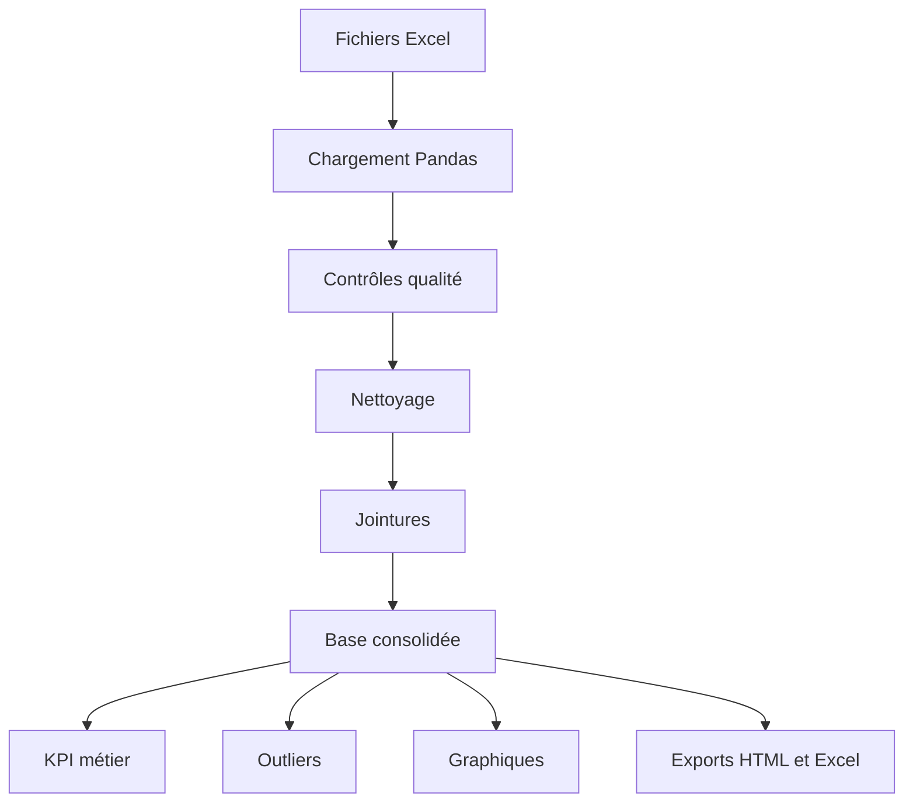

# 📚 MOC — Notebook BottleNeck parfait

Ce dossier est prêt à être glissé dans un coffre **Obsidian**. Il regroupe des cours simples, avancés et professionnels pour reproduire un notebook complet d'analyse de données comme celui du projet **BottleNeck**.

## Objectif du coffre

À la fin, tu dois savoir reproduire un notebook propre qui :

1. charge des fichiers Excel ;
2. contrôle la qualité des données ;
3. nettoie les colonnes et les clés ;
4. fusionne les sources ERP, Web et Liaison ;
5. détecte les anomalies métier et statistiques ;
6. produit des indicateurs utiles ;
7. génère des tableaux, graphiques et exports HTML/Excel ;
8. reste lisible, professionnel et réutilisable.

## Parcours conseillé

### Niveau simple

- [[01-Plan-du-notebook-parfait]]
- [[02-Environnement-et-librairies]]
- [[03-Chargement-des-fichiers-Excel]]

### Niveau avancé

- [[04-Controle-qualite-et-nettoyage]]
- [[05-Jointures-ERP-Web-Liaison]]
- [[06-Analyse-metier-et-KPI]]

### Niveau pro

- [[07-Statistiques-et-outliers]]
- [[08-Visualisations-et-exports]]
- [[09-Structure-code-pro-et-checklist]]

## Carte mentale rapide

## Résultat attendu

Un notebook final doit raconter une histoire :

> Je comprends mes données, je vérifie leur qualité, je corrige les problèmes, je consolide les sources, puis je livre des analyses fiables et actionnables.
